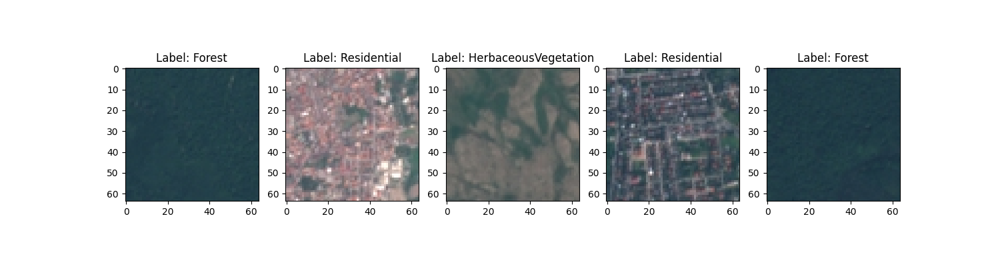

## EuroSAT: Land Cover Classification with TensorFlow

This project provides a framework for training and evaluating a convolutional neural network (CNN) for land cover classification using the EuroSAT dataset. 

### README Breakdown

This README will guide you through the functionalities of the project and provide instructions for running it.

**1. Introduction**

* The EuroSAT dataset is a large-scale Earth observation dataset consisting of satellite images categorized into 10 different land cover classes. This project leverages TensorFlow to build and train a Convolutional Neural Network (CNN) model for accurate land cover classification.

**2. Installation**

* Required libraries (TensorFlow, TensorFlow Datasets, matplotlib, NumPy) are listed in `requirements.txt`.
* Installation of required libraries: `pip install -r requirements.txt`

**3. Data Preprocessing (preprocessing.py)**

* Data Loading
    * Loads the "eurosat/rgb" dataset from TensorFlow Datasets, focusing on the RGB channels for simplicity. The dataset "eurosat/all" includes 13 bands, but is much larger; modeling requires more computation resources.
    * Splits the dataset into training and testing sets (80% training, 20% testing).
* Data Normalization:
    * Converts image pixel values to float32.
    * Normalizes pixel values to the range [0, 1] by dividing by 255.
* Data transformations applied using `tf.data`:
    * `map`: applies normalization and keeps labels.
    * `cache`: caches the transformed data for faster access.
    * `shuffle`: shuffles the training data for randomization.
    * `batch`: groups data points into batches of 32 for training.
    * `prefetch`: prefetches data for efficient pipeline execution.

**4. Data Exploration (data_exploration.py)**

* Prints information about the dataset features and structure.
* Displays sample images and their corresponding labels.

* Calculates the distribution of samples across different land cover classes.

**5. Model Building and Training (classification.py)**

* The architecture of the CNN model was built using `tf.keras.Sequential`.
    * Convolutional layers (Conv2D) with ReLU activation for feature extraction.
    * Max pooling layers (MaxPooling2D) for downsampling.
    * Flatten layer to convert the image data into a 1D vector.
    * Dense layers with ReLU activation and Dropout for classification.
    * Output layer with 10 units and softmax activation for 10 land cover classes.
* The compilation step used optimizer (Adam), loss function (sparse_categorical_crossentropy), and metrics (accuracy).
* The training process used `model.fit` with a specified number of epochs (initially 10) and validation data (test set).
* The model is saved as a `.keras` file with potential error handling using `try-except`.
* The resulting model is briefly evaluated on test accuracy using `model.evaluate`.

**6. Model Evaluation (evaluation.py)**

* The saved model `.keras` is loaded.
* The model is then evaluated on various metrics, such as using `model.evaluate` on the test set and printing the test accuracy.
* In its current form, the model has a test accuracy of *78.78%*

**7. Usage**

* Instructions on how to run the different scripts:
    * Preprocessing: `python preprocessing.py`
    * Data Exploration: `python data_exploration.py` (will generate output files)
    * Training: `python classification.py` (trains and saves a model)
    * Evaluation: `python evaluation.py` (loads and evaluates the saved model)

**8. Additional Notes**

* Possible further functionalities planned for the project include hyperparameter tuning, visualization of training progress.
* References:
    * EuroSat dataset: https://github.com/phelber/eurosat
    * EuroSat Tensorflow documentation: https://www.tensorflow.org/datasets/catalog/eurosat 

**9. License**

* Placeholder for now.